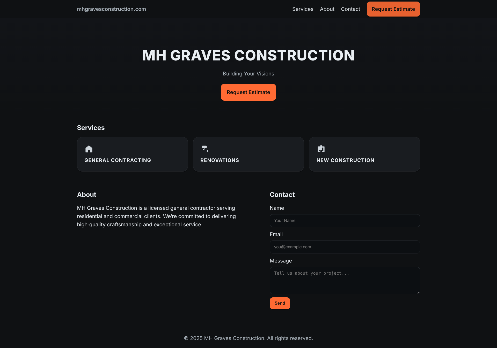

# 📩 Apex-Form

A simple FastAPI application with a contact form. Submissions are sent by email.
This repo includes **Docker** and **Docker Compose** files for easy deployment.

---


## 🚀 Deploy on AWS (EC2)

Follow these steps to deploy the project on an **AWS EC2 Ubuntu instance**.

---

### 1️⃣ Launch EC2

* Log in to [AWS Console](https://console.aws.amazon.com/).
* Create an **Ubuntu 22.04 EC2 instance** (t2.micro is fine).
* In **Security Group**, open ports:

  * `22` (SSH)
  * `8000` (App access)

---

### 2️⃣ Connect to EC2

Use SSH from your computer:

```bash
ssh -i your-key.pem ubuntu@<EC2_PUBLIC_IP>
```

---

### 3️⃣ Install Docker & Docker Compose

Run these commands inside EC2:

```bash
sudo apt update
sudo apt install -y docker.io docker-compose
sudo systemctl enable docker
sudo systemctl start docker
```

---

### 4️⃣ Clone Project

```bash
git clone https://github.com/alihassanml/Apex-Form.git
cd Apex-Form
```

---

### 5️⃣ Run with Docker Compose

Build and start the app:

```bash
docker-compose up -d --build
```

---

### 6️⃣ Access the App

Open in your browser:

```
http://<EC2_PUBLIC_IP>:8000
```

---

## 🛑 Stop the App

```bash
docker-compose down
```

---

## 🔄 Restart the App

```bash
docker-compose up -d
```

---

✅ That’s it! The app is now running on AWS.
Later, we can add **domain + SSL ([https://yourdomain.com](https://yourdomain.com))** with Nginx + Certbot if needed.
